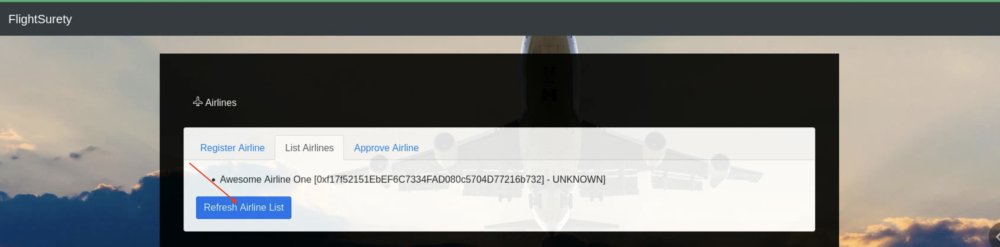
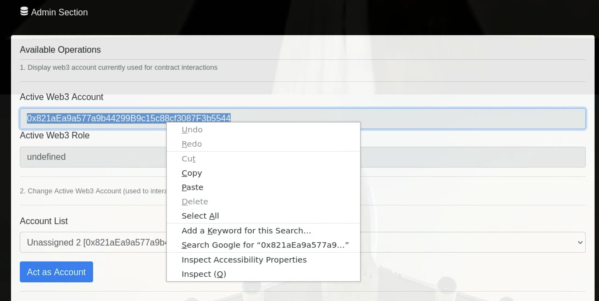
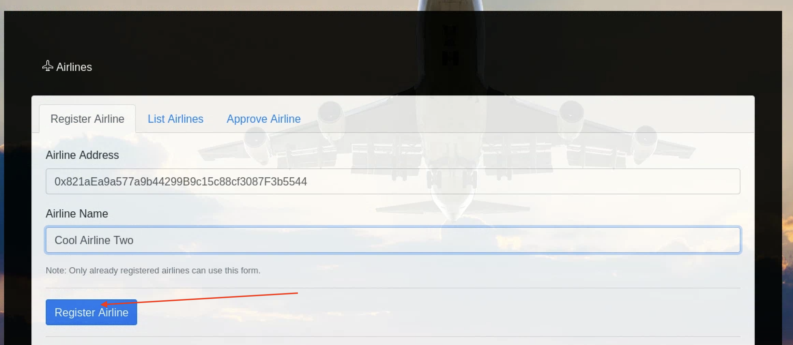

# FlightSurety

FlightSurety is a sample application project for Udacity's Blockchain course.

## Running Locally

Follow the steps below to get project running locally

###  1. Ganache CLI

The default project setup requires at least 50 ETH accounts to be available

```
Dapp -> 15 Accounts
Oracles -> 20 Accounts
```
To start ganche-cli

`ganache-cli -a 60 -m "candy maple cake sugar pudding cream honey rich smooth crumble sweet treat"`

### 2. Install Dependencies

To install project dependencies run

`npm install`

### 3. Deploy Contract

To compile and deploy the contracts run

`truffle migrate --reset`

### 4. Launch Applications

Start Dapp

`npm run dapp`

In a new terminal window run to start Oracle Server

`npm run server`

### 5. Testing the tests

In a new terminal window run to the tests

`truffle test`

## Interacting with the DAPP

### Introduction

The Dapp is distributed into 3 sections
  - Airlines
  - Passengers
  - Admin Section

### Admin Section

The admin section contains helpful utility configurations and action button. The available operations are discussed below.

Available Operations
1. Display web3 account currently used for contract interactions
   This is purely for informative purposes. It displays the current web3 (ETH) account being used to interact with the contract. If the role (airline/passenger) for the account is available. that is also displayed.

2. Change Active Web3 Account (used to interact with contract)
   This allows to easily switch between multiple ETH accounts without the need for metamask. To use, just click on the drop down showing the list of available accounts, select an accont and then click on the "Act as Account" button. This sets the active account used for interacting with the smart contract as the selected account. This allows to quickly switch between multiple airline accounts as well as passenger accounts, while testing the Dapp.

3. Update Flight Status
   This allows you to request flight status update from the oracles. Once triggered, you will need to monitor the server application logs to see how the oracles handle the request and generate the response code returned.

### Airline Section 

The Airline section allows you to 
- Register an airline
- Approve an airline
- List Airlines
- Pay Airline participation fees

### Passenger Section

The passenger section allows a passenger to perform primarily two operations:
1. Purchase Flight Insurance
2. Withdrawal your Insurance Payout to your account 

Additionally, the following buttons are available to help faciliate the operations stated above.
- Refresh flight: This button generates a bunch of mock flights for the participating airlines. This is populated in a dropdown the passenger can then select from while buying insurance.
- Query Balance: This button retrieves the available balance of the passenger. This value is the sum of all unclaimed inusrance payouts to the passenger.


## Oracles Servers

## Testing the Project

Screenshots from a sample walkthrough of the project is attached below. It covers an end-to-end test of the project, from registering airlines, to buying insurance and successfully cashing out insurance payouts.  

### 1. Airline Registration 

First Airline

The first airline is already automically registered as part of the contract deploymnet.
This can be reviewed in the `List Airlines` tab. 





However, the participation fees for the airline has not been paid.

### 2. Pay Participation Fees


### 3. Register a new airline

Select an unassigned account that has previously not been used. click on Act as Account.


copy the address for the account 



enter the copied address and preferred airline name on the airline registration form and click register



For the first four airlines, you might run into this error. This is because only already participating airlines can register new airlines until the 5th airline.


To resolve this, use the admin section to switch to an already participating airline and try again.


To complete the registration process for the airline, follow step 2 (Pay Participation Fees) above. Ensure you acting as the account for which you intend to pay the participation fees or this will fail.


### 4. Approve Airline

You can only vote once. Use the admin section to switch accounts between participating airlines and approve the airline using the approval form. Only already participating airlines can vote/approve other airlines.


### 5. Buy Insurance

To buy insurance, you need to generate mock flights using the refresh flights button. Then select a flight and input the amount (value) of the insurance.


### 6. Trigger Flight Status Check 

Use the admin section to trigger a request to the oracle (via an event emitted by the contract) to provide update on flight status. 


***Note:*** To make testing much easier, the first airline (auto-registered) will always return a status code 20, which will lead to the passenger getting credited. This can be disabled in the oracle server code. However, flight for any other airline will return random status code as expected.


### 7. Check Oracle Server Response


### 8. Withdraw Insurance Payout from contract to Passenger wallet


